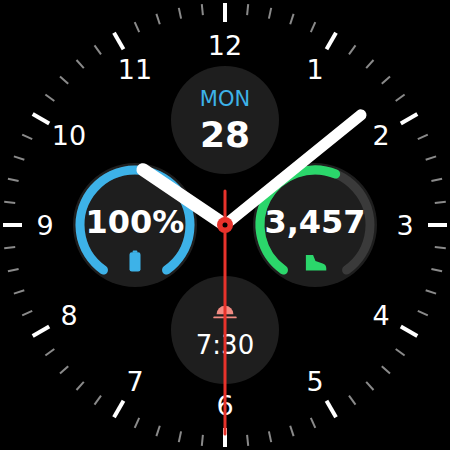

# Classic Dial: a Pixel Watch 3 watch face

An analog face modelled on the old Samsung "info dial" layout:

- 1–12 numerals and a minute track
- **Top:** day of week and date by default
- **Left ring:** battery by default
- **Right ring:** steps by default
- **Bottom:** sunrise/sunset by default
- White hour and minute hands, red second hand
- Ambient (always-on) mode hides the second hand and the sub-dial backgrounds, and dims the rest

All four dials are complication slots, so you can swap each one for something else (heart rate, weather, etc.)
by long-pressing the face ▸ **Edit**. Values with a range or a goal fill the ring. Plain text and icons
show in the middle of an empty ring.



It's written in [Watch Face Format](https://developer.android.com/training/wearables/wff) (WFF) v2,
the format Wear OS 5+ requires for new faces. The package has no code: it's just XML and one preview image.

## Files

| File | What it is |
|---|---|
| `generate_watchface.py` | Builds the face. Change colours, sizes and layout here |
| `app/src/main/res/raw/watchface.xml` | The generated face definition. Don't edit it by hand |
| `preview.html` | A live browser render of `watchface.xml` with sliders for battery and steps |
| `app/src/main/res/drawable/preview.png` | Thumbnail shown in the watch's face picker |

After you edit the generator, run:

```sh
python3 generate_watchface.py
```

To see the preview, serve this folder and open `preview.html`:

```sh
python3 -m http.server 8000   # then open http://localhost:8000/preview.html
```

## Put it on your Pixel Watch 3

### 1. Build the APK

The easiest way is to install [Android Studio](https://developer.android.com/studio), open this
`watchface/` folder and let it sync. Then either press **Build ▸ Build APK(s)** or run:

```sh
./gradlew assembleDebug
# → app/build/outputs/apk/debug/app-debug.apk
```

(If you're using the command line without Android Studio, set `ANDROID_HOME` or add a
`local.properties` file with `sdk.dir=/path/to/Android/sdk`.)

### 2. Turn on debugging on the watch

1. On the watch, go to **Settings ▸ System ▸ About ▸ Versions** and tap **Build number** 7 times.
2. Go to **Settings ▸ Developer options**. Turn on **ADB debugging** and **Wireless debugging**.
3. Under **Wireless debugging**, tap **Pair new device**. The watch shows an IP:port and a pairing code.

The watch and your computer need to be on the same Wi-Fi network.

### 3. Install

```sh
adb pair 192.168.1.23:37000          # the IP:port and code from "Pair new device"
adb connect 192.168.1.23:41000       # the IP:port shown on the main Wireless debugging screen
adb install app/build/outputs/apk/debug/app-debug.apk
```

### 4. Select it

Long-press the current watch face, swipe to the end, tap **+ Add**, and choose **Classic Dial**.
To change what the rings and the bottom slot show, long-press the face ▸ **Edit**.

## Notes

- The watch's built-in steps complication only sends a number, so the right ring starts out empty.
  To make it fill toward your goal, pick a steps complication that has a goal (e.g. from Fitbit) in
  **Edit**.
- Text on the face must use `%s` in templates. `%d` shows nothing on the watch, and neither does text
  built from the built-in `[DAY]` / `[DAY_OF_WEEK_S]` sources, so every dial reads from a complication.
- The release build is signed with the debug key so it's easy to install. Before publishing to Google
  Play, set up your own signing config in `app/build.gradle.kts`.
